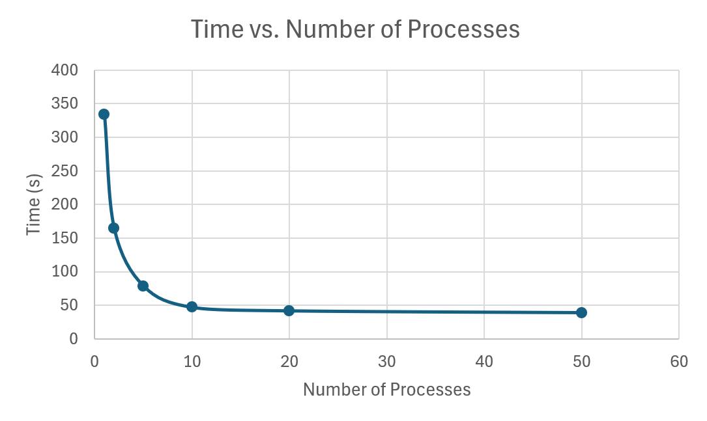

# System Programming Lab 11 Multiprocessing

Author: Leo Mayorga 
Date: 11/19/24

### Overview
Lab 11 generates 50 Mandlebrot images that zoom in progressively into a chosen coordinate. The images are produced in parallel, using multiple processes through fork() as desired by the user.

Each frame is rendered as a JPEG file. All of the fraes are then put together to create a video using ffmpeg.

### Runtime Results

As the number of processes increased, the total runtime decreased. Performance improved from 1 process to around 10 processes because more frames were being rendered in parallel. However, after about 10-12 processes, the runtime stabilized and no longer improved by much.

This happened because my system has 12 CPU cores, so using more than 12 processes does not provide additional parallelism. Beyond that point, there are too many processes competing for the same core.

### Files
 1) jpegrw.h - header file for jpegrw.c to help read and write JPG files
 2) jpegrw.c - JPEG read/write helper
 3) mandel.c - renders each JPEG image

### Commands
-x <coord>    - x coordinate of zoom center
-y <coord>    - y coordinate of zoom center
-s <scale>    - starting scale (zoom out factor)
-m <max>      - max number of iterations per pixel
-W <pixel>    - width of the image in pixels (default == 1000)
-H <pixel>    - height of the image in pixels (default == 1000)
-p <num>      - number of processes to run in parallel
-h            - display help menu

### Compile
Command line: make

### Run
Default command line: ./mandel -p <num>
Custom command line: ./ mandel -x 0.25 -y 0 -s 4 -m 1000 -W 1000 -H 1000 -p 12

### Creating the Animation
Command Line: ffmpeg -i mandel%d.jpg mandel.mp4